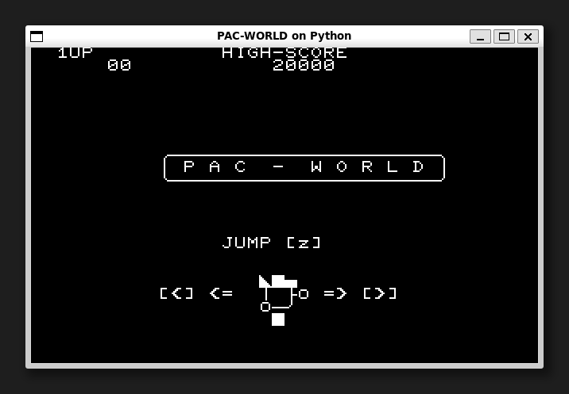
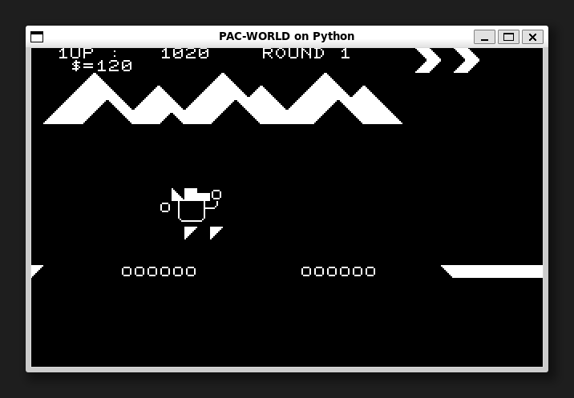

[ [Engligh](README.md) | [日本語](README.ja.md) ]

---
# PAC-WORLD on Python



## Overview

Porting the NEC PC8001 (N-BASIC) game to Python.  
It can work in any environment where the TKInter library runs.

## Requirements

* Python 3.8.2 Leter.  
* Pillow 7.1.2 Leter.  

The installation of Pillow compatible with the Python version is done below:  
```
$ python -m pip install --upgrade pip
$ python -m pip install --upgrade Pillow
```

> See below for Pillow installation.  
> <https://pillow.readthedocs.io/en/latest/installation.html>

## Running the game

For the first time only, clone the git repository.
```
$ git clone https://github.com/aburi6800/Python-PacWorld.git
```

Execute the following command.
```
$ cd Python-PacWorld
$ python pacworld.py
```

> For Linux, use the `python3` command instead of the `python` command,  
> or install the `python-is-python3` package.  
> ```
> $ sudo apt install python-is-python3
> ```

## How to play



- Go to the goal without falling into the hole.  
- Bonus points for passing the `$`.
- You can make a big jump if you jump on the `=`.
- There are 4 stages in all.

## Controls

|key|Description|
| --- | --- |
|left cursor key|Speed down|
|right cursor key|Speed up|
|z|Jump, Start Game|

## Authors
Hitoshi Iwai(aburi6800)

## Thanks
Tetsu Matsushima, author of the original game.

## License
MIT License


