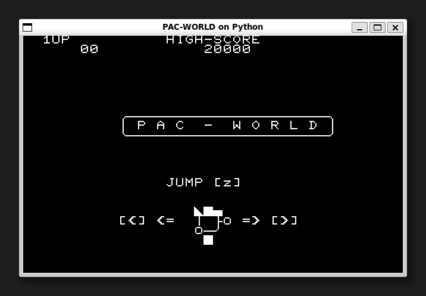
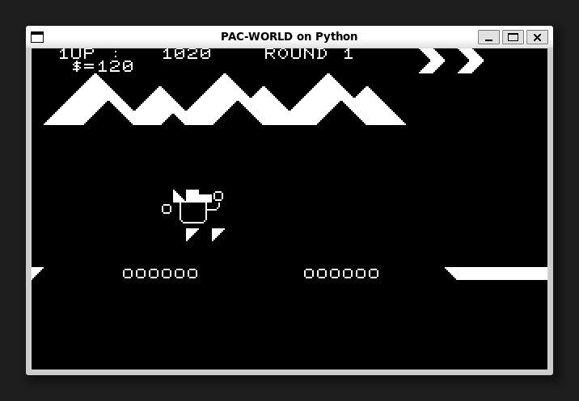

[ [Engligh](README.md) | [日本語](README_ja.md) ]

---
# PAC-WORLD on Python



## 概要

NEC PC8001(N-BASIC)ゲームをPythonへの移植しました。  
TKInterライブラリが動作する環境であれば、どのような環境でも動作可能です。  

## 要件

* Python 3.8.2 以降  
* Pillow 7.1.2 以降  

Pythonのバージョンに対応したPillowのインストールは、以下のように行います：  
```
$ python -m pip install --upgrade pip
$ python -m pip install --upgrade Pillow
```

> Pillowのインストールについては下記を参照ください。  
> <https://pillow.readthedocs.io/en/latest/installation.html>

## ゲームの実行

初回のみ、gitリポジトリのクローンを作成します。  
```
$ git clone https://github.com/aburi6800/Python-PacWorld.git
```

次のコマンドを実行します。  
```
$ cd Python-PacWorld
$ python pacworld.py
```

> Linuxの場合は、`python`コマンドの代わりに`python3`コマンドを使用します、  
> または `python-is-python3` パッケージをインストールしてください。
> ```
> $ sudo apt install python-is-python3
> ```

## How to play



- 穴に落ちないようにゴールまで行ってください。  
- `$`を取るとボーナス点が入ります。
- `=`の上でジャンプすると、大ジャンプができます。
- 全部で4つのステージがあります。

## 操作方法

|key|Description|
| --- | --- |
|左カーソルキー|スピードダウン|
|右カーソルキー|スピードアップ|
|z|ジャンプ、ゲームスタート|

## 作者
Hitoshi Iwai(aburi6800)

## Thanks
Tetsu Matsushima, author of the original game.

## ライセンス
MIT License


